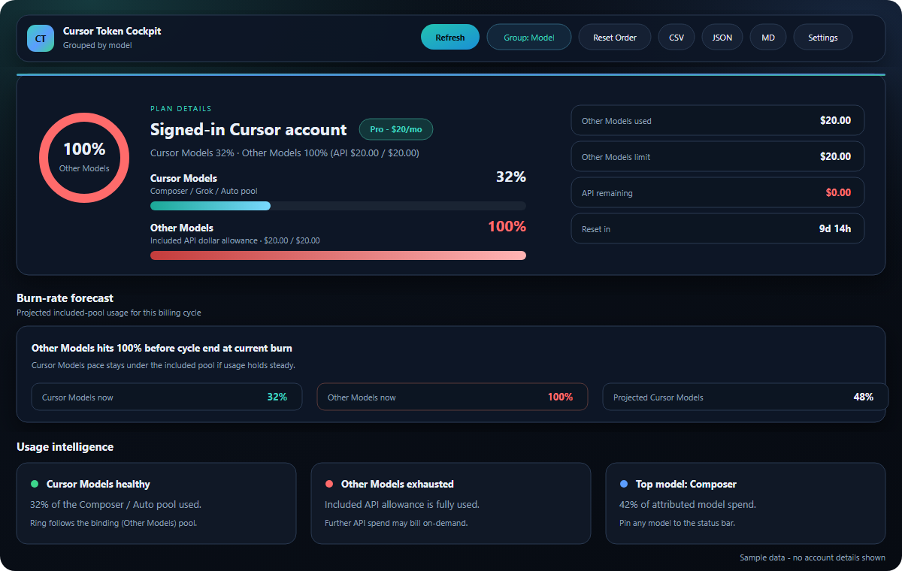
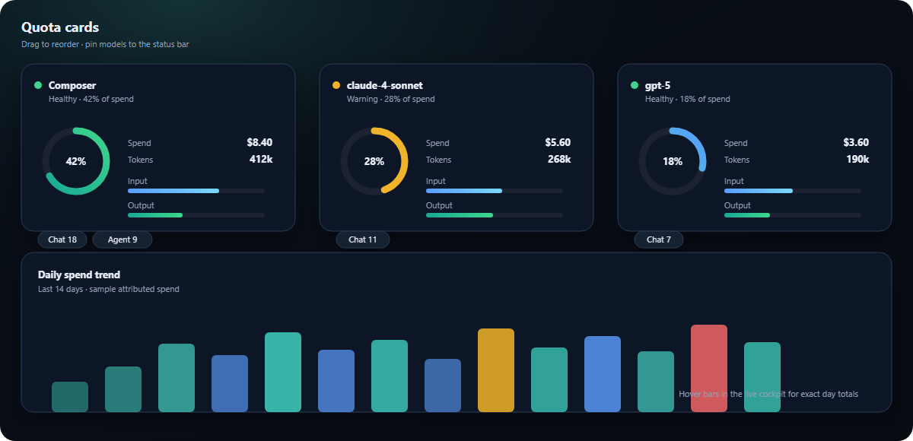
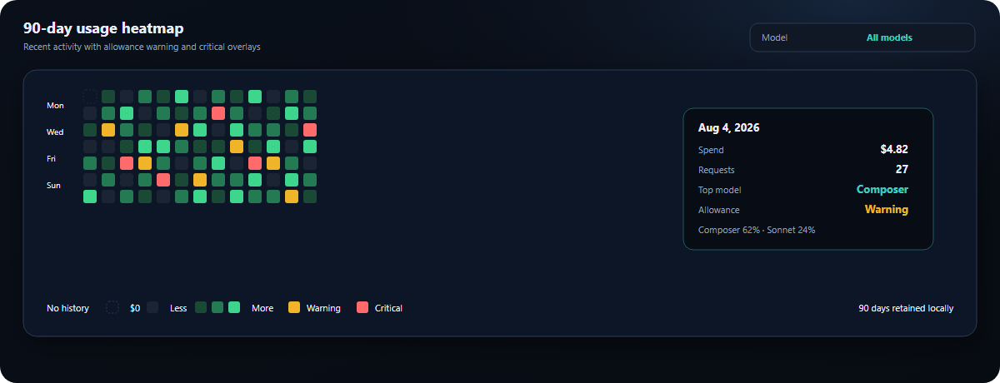

# Cursor Token Monitor

**Know where your Cursor allowance goes — not just how much is left.**

Cursor Token Monitor is a private, model-aware usage cockpit for Cursor. It turns your signed-in account data into plan health, dual Pro quotas, burn-rate forecasts, model comparisons, trends, a 90-day heatmap, and alerts — without sending usage to a third-party service.

The dashboard uses a dark glass cockpit aesthetic (teal / cyan accents, allowance glow rings, dual quota bars, and KPI tiles) so plan risk is readable at a glance.

### Built for questions Cursor's basic usage page cannot answer

- Which model is consuming the most of my allowance?
- At this burn rate, when will Cursor Models / Other Models hit 100%?
- Was today's activity normal, unusually high, or already beyond my warning threshold?
- Which days and models drove a spike?
- How much did this editor session use?
- When will the current allowance reset?

Works in **Cursor** (VS Code–compatible). It reads your existing local Cursor sign-in and calls Cursor’s own usage APIs. Your code, chats, and usage history stay on your machine.

## Requirements

1. **Cursor** desktop app (signed in)
2. That’s it — **no Python** and no extra runtimes

## Getting started

1. Install the extension
2. Reload the window if needed (**Developer: Reload Window**)
3. Look at the **bottom-right status bar**
4. Click it to open the **Token Cockpit** dashboard

## What you’ll see

### Model-aware cockpit

- **Plan details** card with SVG circular allowance ring, billing cycle, reset countdown, and collapsible today/yesterday/7-day spend
- **Dual Pro quotas** matching Cursor's dashboard:
  - **Cursor Models** (Composer / Grok / Auto pool) percent used
  - **Other Models** (included API dollar allowance) percent + $ used / $ limit
  - Ring + alerts follow the binding pool (whichever is closer to exhausted)
- **Burn-rate forecast**: projected included-pool % by cycle end and countdown to 100%
- **Quota cards** for models (or workspaces) with:
  - Circular % ring (spend share)
  - Health status (Healthy / Warning / Critical)
  - Input vs output token bars
  - Chat / request-type pills
  - Rename + pin-to-status-bar (models)
  - Drag-and-drop reorder (persisted)
- **Group toggle**: model vs workspace
- **Trends**: daily spend + daily tokens charts
- Live activity feed, top spending days, longest sessions, Auto estimate
- Toolbar: Refresh, Reset Order, CSV / JSON / MD export, Copy, Settings gear

### A GitHub-style heatmap, built for AI usage

The rolling 90-day heatmap adds signals that a plain contribution count cannot:

- **Rich hover details** — date, spend, request count, top model, allowance signal, and a model breakdown
- **Per-model filtering** — isolate activity for one model without losing account-level threshold context
- **Threshold overlays** — orange and red days reuse the configured warning and critical allowance thresholds
- **Meaningful empty states** — dashed cells mean no local history; dark cells mean history exists with $0 spend
- **Cockpit-native scale** — healthy activity uses the same green palette as model health instead of copying GitHub green blindly

History is kept locally for 90 days. Earlier cells remain visibly unavailable until the extension has observed enough data.

### Status bar

Six formats via `cursorTokenMonitor.statusBarFormat`:

| Format | Example |
|--------|---------|
| `icon` | icon only |
| `dot` | health dot + icon |
| `percent` | icon + % |
| `dotPercent` | dot + % |
| `namePercent` | pinned/top model + % |
| `full` | Safe · $4.12/$20.00 |

Set `statusBarMode` to `rotate` to cycle spend / model / tokens.

### QuickPick mode

Set `displayMode` to `quickpick` (or run **Open QuickPick**) for a keyboard-friendly list with Refresh and Open dashboard buttons.

### Alerts

Configurable warning/critical thresholds (defaults 75% / 90%). Can be disabled with `notificationsEnabled`. Also notifies when today’s spend is unusually high vs your recent average.

## Settings

| Setting | Default | Purpose |
|--------|---------|---------|
| `refreshIntervalSeconds` | `60` | Poll interval |
| `customDatabasePath` | _(empty)_ | Override `state.vscdb` |
| `statusBarMode` | `spend` | `spend` or `rotate` |
| `statusBarFormat` | `full` | One of the six formats above |
| `notificationsEnabled` | `true` | Allowance / spend alerts |
| `warningThreshold` | `75` | Warning % (must be &lt; critical) |
| `criticalThreshold` | `90` | Critical % |
| `viewMode` | `card` | `card` or `list` |
| `displayMode` | `dashboard` | `dashboard` or `quickpick` |

You can also change these from the cockpit **⚙ Settings** modal.

## Commands

- **Open Usage Dashboard** / **Show Details**
- **Open QuickPick**
- **Refresh Usage**
- **Copy Usage Report**
- **Export Usage Data…** (CSV / JSON / Markdown)
- **Check Connection**
- **Reset Cache**
- **Run Privacy Audit**

## Privacy & security

- Reads `cursorAuth/accessToken` from your **local** Cursor database (read-only SQLite; no Python)
- Uses that token only to call `api2.cursor.sh`
- Does **not** upload your code, chats, or token elsewhere
- Does **not** modify `state.vscdb`
- Workspace cards are **estimated** account snapshots associated with the open folder — Cursor does not expose per-project billing IDs

## Troubleshooting

| Problem | Fix |
|--------|-----|
| “Could not read Cursor auth data” | Sign into Cursor; if using a custom install, set `customDatabasePath` |
| “No cursorAuth/accessToken found” | Sign into Cursor |
| Status bar warning | Click the item / Check Connection |
| Cards won’t drag | Ensure `media/vendor/Sortable.min.js` is packaged (reinstall VSIX) |

## What's not possible (yet)

Live per-chat context-window meters, streaming token growth, and conversation DB sizes require Cursor internals that aren’t exposed to extensions.

## License

MIT
