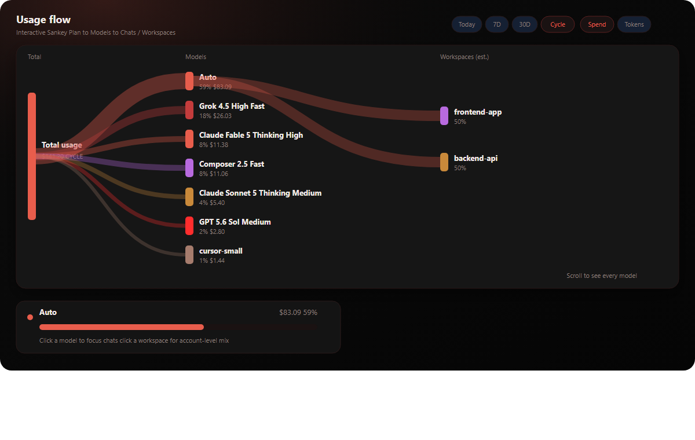
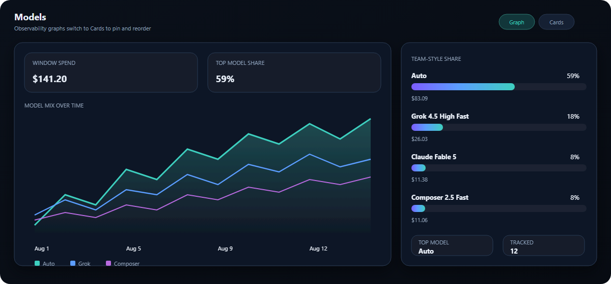
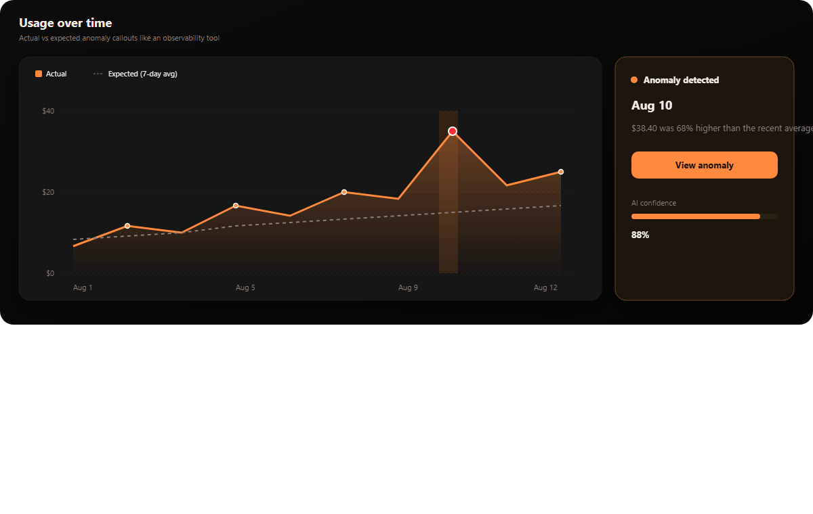

# Cursor Token Monitor

**Know where your Cursor allowance goes — not just how much is left.**

Cursor Token Monitor is a private, model-aware usage cockpit for Cursor. It turns your signed-in account data into plan health, dual Pro quotas, burn-rate forecasts, model comparisons, trends, a 90-day heatmap, and alerts — without sending usage to a third-party service.

The dashboard uses a **matte black** dark aesthetic with crimson / ember accents — solid panels (no glass blur), dual quota bars, and KPI tiles so plan risk reads clearly.

**New in 1.10:** black + crimson theme across cockpit, charts, Sankey, and marketplace screenshots. Total-usage health still reserves bright red for 85%+.

### Built for questions Cursor's basic usage page cannot answer

- Which model is consuming the most of my allowance?
- At this burn rate, when will Cursor Models / Other Models hit 100%?
- Was today's activity normal, unusually high, or already beyond my warning threshold?
- Which days and models drove a spike?
- How much did this editor session use?
- When will the current allowance reset?

Works in **Cursor** (VS Code–compatible). It reads your existing local Cursor sign-in and calls Cursor’s own usage APIs. Your code, chats, and usage history stay on your machine.

## Requirements

1. **Cursor** desktop app (signed in)
2. That’s it — **no Python** and no extra runtimes

## Getting started

1. Install the extension
2. Reload the window if needed (**Developer: Reload Window**)
3. Look at the **bottom-right status bar**
4. Click it to open the **Token Cockpit** dashboard

## What you’ll see

### Interactive Sankey usage flow

- **Total → Models → Chats / Workspaces** ribbons (scrollable when you have many models)
- Hover a model to highlight its path; click to focus chats
- Click a workspace to reveal account-level model mix (workspaces remain estimated — Cursor does not expose per-project billing IDs)
- Time window: Today / 7D / 30D / Cycle
- Metric toggle: Spend / Tokens / Requests

### Models Graph (default) or Cards

- Default **Graph** layout: window KPIs with **(i)** tips, multi-series model mix, gradient share bars
- Switch to **Cards** anytime to pin models, rename, and drag-reorder

### Usage over time (observability-style)

- Actual vs 7-day expected baseline
- Anomaly band + confidence callout when a day spikes

### Plan health and forecasts

- **Plan details** card with SVG circular allowance ring, billing cycle, reset countdown, and collapsible today/yesterday/7-day spend
- **Dual Pro quotas** matching Cursor's dashboard:
  - **Cursor Models** (Composer / Grok / Auto pool) percent used
  - **Other Models** (included API dollar allowance) percent + $ used / $ limit
  - Ring + status bar colors follow **total included usage** (warm taupe → copper → crimson at 85%+)
- **Burn-rate forecast**: projected included-pool % by cycle end and countdown to 100%

### A GitHub-style heatmap, built for AI usage

The rolling 90-day heatmap adds signals that a plain contribution count cannot:

- **Rich hover details** — date, spend, request count, top model, allowance signal, and a model breakdown
- **Per-model filtering** — isolate activity for one model without losing account-level threshold context
- **Threshold overlays** — copper and crimson days reuse the configured warning (65%) and critical (85%) thresholds
- **Meaningful empty states** — dashed cells mean no local history; dark cells mean history exists with $0 spend
- **Cockpit-native scale** — healthy activity uses the warm taupe palette; bright red only for critical days

History is kept locally for 90 days. Earlier cells remain visibly unavailable until the extension has observed enough data.

### More cockpit sections

- **Live activity**, **Top spending days**, and **Longest AI sessions** — collapsed by default (expand when you need them)
- Auto estimate, session stats, export toolbar (CSV / JSON / MD), Settings gear

### Status bar

Six formats via `cursorTokenMonitor.statusBarFormat`:

| Format | Example |
|--------|---------|
| `icon` | icon only |
| `dot` | health dot + icon |
| `percent` | icon + % |
| `dotPercent` | dot + % |
| `namePercent` | pinned/top model + % |
| `full` | Safe · $4.12/$20.00 |

Set `statusBarMode` to `rotate` to cycle spend / model / tokens.

### QuickPick mode

Set `displayMode` to `quickpick` (or run **Open QuickPick**) for a keyboard-friendly list with Refresh and Open dashboard buttons.

### Alerts

Configurable warning/critical thresholds (defaults 65% / 85%). Can be disabled with `notificationsEnabled`. Also notifies when today’s spend is unusually high vs your recent average.

## Settings

| Setting | Default | Purpose |
|--------|---------|---------|
| `refreshIntervalSeconds` | `60` | Poll interval |
| `customDatabasePath` | _(empty)_ | Override `state.vscdb` |
| `statusBarMode` | `spend` | `spend` or `rotate` |
| `statusBarFormat` | `full` | One of the six formats above |
| `notificationsEnabled` | `true` | Allowance / spend alerts |
| `warningThreshold` | `65` | Warning % (must be &lt; critical) |
| `criticalThreshold` | `85` | Critical % — red styling above this |
| `viewMode` | `card` | `card` or `list` |
| `displayMode` | `dashboard` | `dashboard` or `quickpick` |

You can also change these from the cockpit **⚙ Settings** modal.

## Commands

- **Open Usage Dashboard** / **Show Details**
- **Open QuickPick**
- **Refresh Usage**
- **Copy Usage Report**
- **Export Usage Data…** (CSV / JSON / Markdown)
- **Check Connection**
- **Reset Cache**
- **Run Privacy Audit**

## Privacy & security

- Reads `cursorAuth/accessToken` from your **local** Cursor database (read-only SQLite; no Python)
- Uses that token only to call `api2.cursor.sh`
- Does **not** upload your code, chats, or token elsewhere
- Does **not** modify `state.vscdb`
- Workspace cards are **estimated** account snapshots associated with the open folder — Cursor does not expose per-project billing IDs

## Troubleshooting

| Problem | Fix |
|--------|-----|
| “Could not read Cursor auth data” | Sign into Cursor; if using a custom install, set `customDatabasePath` |
| “No cursorAuth/accessToken found” | Sign into Cursor |
| Status bar warning | Click the item / Check Connection |
| Cards won’t drag | Ensure `media/vendor/Sortable.min.js` is packaged (reinstall VSIX) |

## What's not possible (yet)

Live per-chat context-window meters, streaming token growth, and conversation DB sizes require Cursor internals that aren’t exposed to extensions.

## License

MIT
